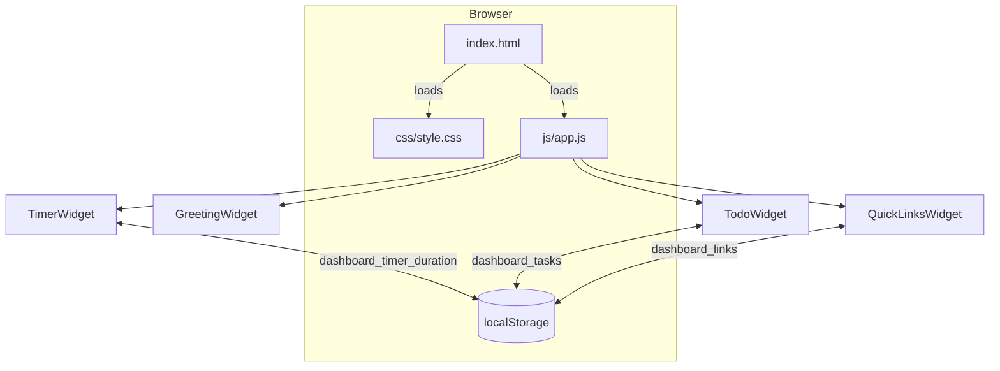
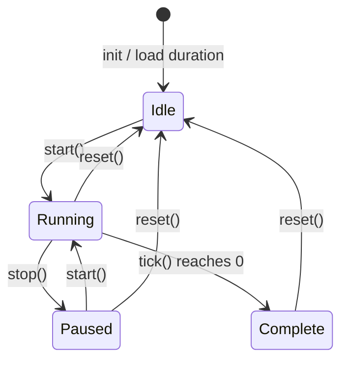

# Design Document

## Personal Dashboard

---

## Overview

The personal dashboard is a self-contained, single-page web application delivered as a plain HTML file. It runs entirely in the browser with no server, no build step, and no external dependencies. All state is persisted to the browser's `localStorage`. The application is composed of four independent widgets — Greeting, Pomodoro Timer, To-Do List, and Quick Links — rendered together on one page.

The technology stack is deliberately minimal:

- **HTML5** — single `index.html` entry point
- **CSS3** — single stylesheet at `css/style.css`
- **Vanilla JavaScript (ES6+)** — single module at `js/app.js`
- **localStorage API** — sole persistence layer

No frameworks, no CDN resources, no network requests. The entire application loads from the local file system or a static host and remains fully functional offline.

---

## Architecture

The application follows a **widget-module pattern**. Each widget is encapsulated as a plain JavaScript object (or IIFE module) that owns its DOM subtree, its business logic, and its localStorage access. A thin bootstrap routine in `app.js` initialises each widget on `DOMContentLoaded`.

```
app.js
├── GreetingWidget   — time/date display, greeting message
├── TimerWidget      — Pomodoro countdown, start/stop/reset, custom duration
├── TodoWidget       — task CRUD, validation, sorting, persistence
└── QuickLinksWidget — link CRUD, validation, persistence
```

There is no shared state bus or global store. Each widget reads from and writes to its own namespaced `localStorage` key. Widgets do not communicate with each other.



### Lifecycle

1. Browser parses `index.html`, which links `css/style.css` and `js/app.js` (type="module" or deferred script).
2. `app.js` listens for `DOMContentLoaded`.
3. Each widget module is initialised in order: Greeting → Timer → Todo → QuickLinks.
4. Each widget's `init()` function queries the DOM for its root element, restores state from `localStorage`, and attaches event listeners.
5. The Greeting widget starts a `setInterval` (1 second) for live clock updates.
6. User interactions are handled entirely within each widget module.

---

## Components and Interfaces

### GreetingWidget

**Responsibility**: Display current time (HH:MM), current date (human-readable), and a time-of-day greeting. Update the clock every second.

**Public interface**:
```js
GreetingWidget.init(containerElement)
// Starts the interval and renders immediately.
```

**Internal functions**:
```js
formatTime(date)        // Date → "HH:MM"
formatDate(date)        // Date → "Weekday, Month DD, YYYY"
getGreeting(hour)       // number (0-23) → "Good Morning|Afternoon|Evening|Night"
render(date)            // Date → updates DOM text nodes
```

**Greeting logic**:

| Hour range    | Greeting       |
|---------------|---------------|
| 05:00–11:59   | Good Morning  |
| 12:00–17:59   | Good Afternoon|
| 18:00–20:59   | Good Evening  |
| 21:00–04:59   | Good Night    |

**No localStorage involvement.**

---

### TimerWidget

**Responsibility**: Pomodoro countdown with start, stop, and reset controls. Optional configurable duration (1–99 minutes). Notify user on completion.

**Public interface**:
```js
TimerWidget.init(containerElement)
// Restores saved duration from localStorage, renders initial state.
```

**Internal state**:
```js
{
  durationSeconds: number,   // configured session length (default 1500)
  remainingSeconds: number,  // current countdown value
  intervalId: number | null, // setInterval handle; null when stopped
  isRunning: boolean
}
```

**Internal functions**:
```js
formatTime(seconds)     // number → "MM:SS"
start()                 // begins setInterval, sets isRunning = true
stop()                  // clears interval, isRunning = false, retains remaining
reset()                 // clears interval, remaining = durationSeconds
setDuration(minutes)    // validates 1–99, saves to localStorage, resets display
tick()                  // called each second; decrements remaining, checks for 0
notifyComplete()        // fires browser Notification or plays Audio alert
saveDuration(seconds)   // writes to localStorage key `dashboard_timer_duration`
loadDuration()          // reads from localStorage, falls back to 1500
render()                // updates MM:SS display in DOM
```

**State machine**:



**Duration change guard**: `setDuration()` checks `isRunning`; if true, it returns immediately without updating state or localStorage.

---

### TodoWidget

**Responsibility**: Full CRUD for tasks with localStorage persistence. Optional duplicate prevention and sorting.

**Public interface**:
```js
TodoWidget.init(containerElement)
// Loads tasks from localStorage, renders list.
```

**Task data model** (see Data Models section).

**Internal functions**:
```js
addTask(title)            // validates, creates Task object, saves, renders
validateTitle(title)      // string → boolean (rejects empty/whitespace)
isDuplicate(title, tasks) // string, Task[] → boolean (case-insensitive match on incomplete tasks)
editTask(id, newTitle)    // validates, mutates task in array, saves, renders
deleteTask(id)            // filters task from array, saves, renders
toggleComplete(id)        // flips completed boolean, saves, renders
sortTasks(tasks, order)   // Task[], 'alpha-asc'|'alpha-desc'|'date' → Task[] (non-mutating)
saveTasks(tasks)          // JSON.stringify, localStorage.setItem
loadTasks()               // localStorage.getItem, JSON.parse, fallback to []
render()                  // re-renders entire task list from current tasks array
renderTask(task)          // returns a single task DOM element
showError(message)        // displays inline validation message
generateId()              // returns a unique string id (e.g. Date.now() + Math.random())
```

**Sorting strategy** — `sortTasks` returns a new sorted array; the original array (and localStorage) are never mutated by sort alone:

| Order          | Comparator                              |
|----------------|-----------------------------------------|
| `alpha-asc`    | `title.localeCompare()` ascending       |
| `alpha-desc`   | `title.localeCompare()` descending      |
| `date`         | `createdAt` ascending (oldest first)    |

---

### QuickLinksWidget

**Responsibility**: Manage a list of labelled URL bookmarks. Persist to localStorage.

**Public interface**:
```js
QuickLinksWidget.init(containerElement)
// Loads links from localStorage, renders buttons.
```

**Link data model** (see Data Models section).

**Internal functions**:
```js
addLink(label, url)     // validates both fields, creates Link, saves, renders
validateLabel(label)    // string → boolean (rejects empty/whitespace)
validateUrl(url)        // string → boolean (URL constructor check)
deleteLink(id)          // filters link from array, saves, renders
openLink(url)           // window.open(url, '_blank', 'noopener,noreferrer')
saveLinks(links)        // JSON.stringify, localStorage.setItem
loadLinks()             // localStorage.getItem, JSON.parse, fallback to []
render()                // re-renders link buttons from current links array
renderLink(link)        // returns a single link button DOM element
showError(message)      // inline validation message in the add-link form
generateId()            // unique string id
```

---

### Storage Module (inline utility)

A small, shared utility (defined at the top of `app.js` or as a closure) wraps localStorage access and centralises error handling:

```js
Storage = {
  KEYS: {
    TASKS:          'dashboard_tasks',
    LINKS:          'dashboard_links',
    TIMER_DURATION: 'dashboard_timer_duration'
  },
  get(key, fallback) {
    try {
      const raw = localStorage.getItem(key);
      return raw ? JSON.parse(raw) : fallback;
    } catch {
      console.warn(`Storage: failed to parse key "${key}", using fallback`);
      return fallback;
    }
  },
  set(key, value) {
    try {
      localStorage.setItem(key, JSON.stringify(value));
    } catch (e) {
      console.warn(`Storage: write failed for key "${key}"`, e);
    }
  }
};
```

If `localStorage` is unavailable (private browsing in some browsers), `Storage.set` silently fails and `Storage.get` returns the fallback. A one-time non-blocking warning banner is shown to the user in this case.

---

## Data Models

### Task

```js
{
  id:          string,   // unique identifier, e.g. "1720000000000-0.1234"
  title:       string,   // non-empty, non-whitespace task description
  completed:   boolean,  // false on creation
  createdAt:   number    // Date.now() timestamp (ms since epoch)
}
```

**Invariants**:
- `id` is unique across all tasks
- `title.trim().length > 0`
- `completed` is strictly boolean
- `createdAt` is a positive integer

### Link

```js
{
  id:    string,  // unique identifier
  label: string,  // non-empty display label
  url:   string   // valid absolute URL (passes `new URL(value)` without throwing)
}
```

**Invariants**:
- `id` is unique across all links
- `label.trim().length > 0`
- `url` is parseable by the `URL` constructor

### Timer Duration (localStorage primitive)

Stored as a raw number (seconds) under `dashboard_timer_duration`. Not a JSON object. Valid range: 60–5940 (1–99 minutes as seconds).

---

## Correctness Properties

*A property is a characteristic or behavior that should hold true across all valid executions of a system — essentially, a formal statement about what the system should do. Properties serve as the bridge between human-readable specifications and machine-verifiable correctness guarantees.*

### Property 1: Time formatting produces HH:MM output

*For any* valid `Date` object, `formatTime(date)` SHALL return a string matching the pattern `HH:MM` where HH is zero-padded hours (00–23) and MM is zero-padded minutes (00–59).

**Validates: Requirements 1.1**

---

### Property 2: Date formatting contains required components

*For any* valid `Date` object, `formatDate(date)` SHALL return a string that contains a full weekday name, a full month name, a numeric day, and a four-digit year.

**Validates: Requirements 1.2**

---

### Property 3: Greeting is determined entirely by hour

*For any* integer hour `h` in [0, 23], `getGreeting(h)` SHALL return exactly one of the four defined greeting strings, and the returned greeting SHALL match the correct time range:
- [5, 11] → "Good Morning"
- [12, 17] → "Good Afternoon"
- [18, 20] → "Good Evening"
- [21, 23] ∪ [0, 4] → "Good Night"

**Validates: Requirements 1.3, 1.4, 1.5, 1.6**

---

### Property 4: Timer countdown formatting produces MM:SS output

*For any* integer `s` in [0, 5940], `formatTime(s)` SHALL return a string matching the pattern `MM:SS` where both parts are zero-padded and the total represented time equals `s` seconds.

**Validates: Requirements 2.3**

---

### Property 5: Stop preserves remaining time

*For any* timer state with a `remainingSeconds` value `r`, calling `stop()` SHALL leave `remainingSeconds` equal to `r` and set `isRunning` to false.

**Validates: Requirements 2.4**

---

### Property 6: Reset restores configured duration

*For any* timer state (running or paused, with any remaining time), calling `reset()` SHALL set `remainingSeconds` equal to `durationSeconds` and set `isRunning` to false.

**Validates: Requirements 2.5**

---

### Property 7: Valid custom durations are accepted and persisted

*For any* integer `m` in [1, 99], calling `setDuration(m)` when the timer is idle SHALL set `durationSeconds` to `m * 60` and persist that value to localStorage, recoverable by `loadDuration()`.

**Validates: Requirements 2.7**

---

### Property 8: Duration change is ignored while timer is running

*For any* timer in the running state and any attempted new duration value, calling `setDuration()` SHALL leave `durationSeconds`, `remainingSeconds`, and `isRunning` completely unchanged.

**Validates: Requirements 2.8**

---

### Property 9: Valid task creation populates all required fields

*For any* non-empty, non-whitespace string `title`, `addTask(title)` SHALL produce a Task object where `title` equals the input, `completed` is false, `id` is a non-empty string, and `createdAt` is a positive integer.

**Validates: Requirements 3.1**

---

### Property 10: Whitespace-only and empty inputs are rejected

*For any* string `s` where `s.trim().length === 0`, both `addTask(s)` and the edit-save path SHALL reject the input and leave the task list in its previous state (task count and task contents unchanged).

**Validates: Requirements 3.2, 3.5**

---

### Property 11: Duplicate task titles are rejected (case-insensitive)

*For any* task list containing an incomplete task with title `t`, submitting any string `s` where `s.trim().toLowerCase() === t.trim().toLowerCase()` when duplicate prevention is enabled SHALL be rejected and the task list SHALL remain unchanged.

**Validates: Requirements 3.3**

---

### Property 12: Completion toggle is a round trip

*For any* task, calling `toggleComplete` twice SHALL return the task to its original `completed` state.

**Validates: Requirements 3.6, 3.7**

---

### Property 13: Deleted task is absent from the list

*For any* task list containing a task with id `x`, calling `deleteTask(x)` SHALL produce a task list that contains no task with id `x`, and the count SHALL decrease by exactly one.

**Validates: Requirements 3.8**

---

### Property 14: Task serialization round trip

*For any* array of Task objects, `JSON.parse(JSON.stringify(tasks))` followed by the storage `get/set` round trip SHALL produce an array deeply equal to the original (all fields preserved, same order).

**Validates: Requirements 3.9, 3.10**

---

### Property 15: Sorting does not mutate stored data

*For any* array of Tasks and any sort order, `sortTasks(tasks, order)` SHALL return a correctly ordered array while the original `tasks` array remains unmodified, and the result of `loadTasks()` before and after sort SHALL be identical.

**Validates: Requirements 3.11**

---

### Property 16: Valid link creation preserves label and URL

*For any* non-empty label `l` and valid URL string `u`, `addLink(l, u)` SHALL produce a Link object where `label === l`, `url === u`, and `id` is a non-empty string.

**Validates: Requirements 4.1**

---

### Property 17: Invalid link submissions are rejected

*For any* submission where the label is empty/whitespace OR the URL string throws when passed to `new URL()`, `addLink()` SHALL reject the submission and the links list SHALL remain unchanged.

**Validates: Requirements 4.2**

---

### Property 18: Link deletion removes exactly the target link

*For any* links list containing a link with id `x`, calling `deleteLink(x)` SHALL produce a links list that contains no link with id `x`, and the count SHALL decrease by exactly one.

**Validates: Requirements 4.4**

---

### Property 19: Link serialization round trip

*For any* array of Link objects, the storage `get/set` round trip SHALL produce an array deeply equal to the original (all fields preserved, same order).

**Validates: Requirements 4.5, 4.6**

---

### Property 20: Malformed localStorage data falls back to empty state

*For any* malformed JSON string (or null) stored under any dashboard storage key, calling `Storage.get(key, fallback)` SHALL return the provided `fallback` value without throwing.

**Validates: Requirements 5.4**

---

## Error Handling

### Input Validation

All user-submitted text is validated before any state mutation:

| Input | Rejection condition | User feedback |
|-------|--------------------|----|
| Task title (add/edit) | `title.trim().length === 0` | Inline error below input |
| Task title (add, duplicate mode on) | case-insensitive match with existing incomplete task | Inline duplicate warning |
| Link label | `label.trim().length === 0` | Inline error in form |
| Link URL | `new URL(url)` throws | Inline error in form |
| Timer duration | outside [1, 99] integer range | Duration field reset to current value |
| Timer duration during countdown | `isRunning === true` | Change silently ignored |

Inline error messages use `aria-live="polite"` regions so screen readers announce them.

### localStorage Failures

Two failure modes are handled:

1. **Malformed JSON on read** — caught by try/catch in `Storage.get()`; widget initialises with empty/default state. A non-blocking banner (`role="alert"`) is shown once per session: "Could not load saved data. Starting fresh."

2. **Storage unavailable (QuotaExceededError or SecurityError on write)** — caught in `Storage.set()`; the in-memory state is still updated so the current session works, but data will not persist. A different banner warns: "Storage unavailable. Changes will not be saved."

Neither failure crashes the application or blocks user interaction.

### Timer Completion

On countdown reaching 00:00:
1. The interval is cleared and `isRunning` is set to false.
2. The Notification API is used if permission is granted (`Notification.permission === 'granted'`).
3. If permission is denied or the API is unavailable, an `Audio` object plays a short beep (a base64-encoded data URI embedded in `app.js` to avoid network requests).
4. The display freezes at "00:00" until the user clicks Reset.

---

## Testing Strategy

### Overview

The project uses a dual-testing approach:

- **Unit / property tests** — pure functions tested with [fast-check](https://fast-check.dev/) (property-based testing for JavaScript). Minimum 100 iterations per property test.
- **Example-based unit tests** — specific scenarios and edge cases tested with a lightweight test runner (Jest or plain `assert` statements run with Node).
- **Manual / smoke tests** — cross-browser checks, responsive layout, performance, and network-request absence.

> Property-based testing is appropriate here because the core logic (formatting, validation, sorting, serialization) consists of pure functions with large input spaces where many iterations will find edge cases that hand-picked examples miss.

### Property-Based Testing Library

**[fast-check](https://fast-check.dev/)** — well-maintained, zero-dependency compatible with Node, supports arbitrary generators for strings, integers, arrays, and objects.

Each property test must run a minimum of **100 iterations** (`numRuns: 100` in fast-check config) and be tagged:

```
// Feature: personal-dashboard, Property N: <property_text>
```

### Unit Test Coverage

| Area | Test type | Notes |
|------|-----------|-------|
| `formatTime(date)` | Property 1 | HH:MM format for all dates |
| `formatDate(date)` | Property 2 | All date components present |
| `getGreeting(hour)` | Property 3 | All 24 hours mapped correctly |
| `formatTime(seconds)` | Property 4 | MM:SS for all 0–5940 values |
| Timer stop | Property 5 | Remaining time preserved |
| Timer reset | Property 6 | Returns to configured duration |
| `setDuration` valid | Property 7 | 1–99 range accepted + persisted |
| `setDuration` while running | Property 8 | Change ignored |
| Task creation | Property 9 | All fields populated correctly |
| Whitespace rejection | Property 10 | All-whitespace strings rejected |
| Duplicate prevention | Property 11 | Case-insensitive match rejected |
| Completion toggle round trip | Property 12 | Toggle twice = original state |
| Task deletion | Property 13 | Target absent, count −1 |
| Task serialization | Property 14 | Round-trip preserves all fields |
| Sorting | Property 15 | Correct order, original unchanged |
| Link creation | Property 16 | All fields preserved |
| Link validation | Property 17 | Invalid inputs rejected |
| Link deletion | Property 18 | Target absent, count −1 |
| Link serialization | Property 19 | Round-trip preserves all fields |
| Storage error handling | Property 20 | Malformed JSON → fallback |
| Timer init default | Example | State = 1500 seconds |
| Timer reaches 00:00 | Example | Notification fired, interval cleared |
| localStorage keys | Example | Correct namespaced keys used |
| Link opens new tab | Example | `window.open` with correct args |
| Edit saves updated title | Example | DOM reflects new title |
| Widget DOM presence | Example | All four widgets in document |

### Manual / Smoke Tests

- **Cross-browser**: Open in Chrome, Firefox, Edge, Safari; verify all widgets render and function.
- **Responsive**: Resize below 768 px; verify each widget stacks full-width.
- **Performance**: Page load < 2 s, interactions feel instant (< 100 ms).
- **No network requests**: Browser DevTools Network tab shows zero external requests on load.
- **No external resources**: Source of `index.html` contains no CDN URLs.
- **Offline mode**: Disable network in DevTools; verify all features still work.
- **localStorage persistence**: Add tasks/links, reload page, verify data survives.
- **localStorage unavailable**: Test in a context where `localStorage` throws; verify graceful warning banner appears.
